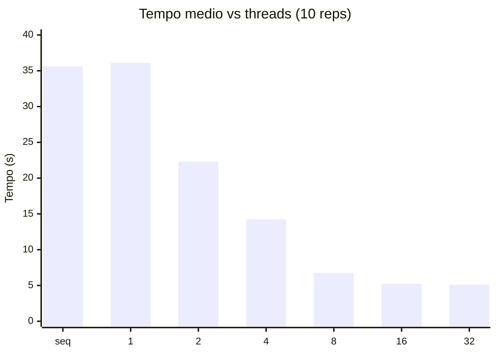

# Filtro bilateral com OpenMP

**Impacto do número de threads no desempenho e na eficiência energética**

> **Pergunta.** Qual número de threads oferece a melhor relação entre tempo de execução e eficiência energética na aplicação de um filtro bilateral em imagens 4K com OpenMP?
>
> **Hipótese.** O menor tempo ocorre perto do número de núcleos físicos (ou um pouco além, com SMT). A melhor eficiência — e, por extensão, a melhor relação desempenho/energia — acontece *antes* desse ponto, porque o ganho de tempo diminui enquanto o hardware continua ocupado.

Este documento resume a implementação, o protocolo de 10 execuções e a leitura dos resultados. Ainda é um **experimento-piloto em notebook**; os números finais do artigo devem ser repetidos na máquina padronizada do laboratório.

---

## Por que o filtro bilateral

O enunciado sugere *processamento de imagens / aplicação de filtros*. O bilateral (Tomasi e Manduchi, 1998) encaixa nesse tema e, ao mesmo tempo, é uma carga melhor para PCD do que um blur linear:

| Critério | Por que importa neste trabalho |
| :--- | :--- |
| **Relevância** | Denoising com preservação de bordas; usado em fotografia computacional e como pré-processamento em visão |
| **Compute-bound** | Cada pixel percorre um kernel \( (2r+1)^2 \) e calcula dois gaussianos, com `expf` — dá para medir tempo com confiança |
| **Paralelo natural** | Cada pixel de saída é independente: um `#pragma omp parallel for` nas linhas, sem região crítica |
| **Carga controlável** | Aumentar o raio aumenta a conta *sem* mudar a imagem; 4K aumenta o tempo total |
| **Validação simples** | A saída paralela tem de coincidir com a sequencial; o PSNR mostra que o ruído de fato sai |

Não é convolução: o peso de cada vizinho depende da **diferença de intensidade**, então o filtro é não-linear. O título do trabalho deve falar em *filtro bilateral*, não em *filtros de convolução*.

A foto **não precisa ser cinza**. Cinza foi só o primeiro protótipo. A versão atual filtra os três canais RGB de forma independente — simplificação aceitável para o curso; uma versão mais fotográfica usaria CIE Lab.

Não existe uma “4K oficial” de bilateral. O padrão da literatura é foto limpa + **ruído Gaussiano (AWGN)** com σ conhecido. Usamos uma paisagem CC0 4000×2250 e somamos σ = 25, reproduzível.

---

## O que foi implementado

Arquivo único: `bilateral_openmp.c`.

```text
foto 4K RGB  →  AWGN σ=25  →  bilateral (σ_s = r/2, σ_r = 2σ)
                              ├ sequencial  (baseline)
                              └ OpenMP      1, 2, 4, 8, 16, 32 threads
```

- Kernel espacial pré-computado; o kernel de faixa (`expf` da diferença de intensidade) é por vizinho.
- Bordas: vizinhos fora da imagem são ignorados; o pixel é renormalizado por `wsum`.
- OpenMP: `schedule(static)`, `num_threads(N)`, um laço paralelo por canal.
- 32 threads é **oversubscription** (o CPU tem 16 lógicos) — pedido pelo enunciado (“dezenas de threads quando possível”).

**Origem.** O arquivo é implementação **própria** da definição publicada; não foi copiado de FFmpeg, OpenCV, repositório nem slide de disciplina. O que veio da literatura é a *fórmula* e o *método de teste*, citados abaixo.

```bash
gcc -O3 -fopenmp -o bilateral_openmp.exe bilateral_openmp.c
./bilateral_openmp.exe                              # 1 aquecimento + 10 reps
./bilateral_openmp.exe 8                            # seq vs 8 threads
./bilateral_openmp.exe 8 9 imagens/montanha_4k.ppm 25
```

| Argumento | Exemplo | Significado |
| ---: | ---: | :--- |
| 1 | `8` | número de **threads** OpenMP |
| 2 | `9` | **raio** do kernel (kernel \(19\times19\)) |
| 3 | `imagens/montanha_4k.ppm` | imagem de entrada |
| 4 | `25` | **σ do ruído Gaussiano** (AWGN). `0` desliga o ruído |

**Correção.** Em todas as configurações, \(\max |I_\text{par} - I_\text{seq}| = 0\).  
**Qualidade.** PSNR da ruidosa = **20,41 dB**; da filtrada = **25,23 dB**. O ruído sai e a imagem se aproxima da foto limpa; as arestas da rocha permanecem. Ver `imagens/comparacao_bilateral.png`.

---

## A implementação é a mais eficiente possível?

Não. Sequencial e OpenMP aqui são a **definição exata** do filtro bilateral (Tomasi e Manduchi), escrita para ser comparável pixel a pixel — não o código mais rápido que existe em 2026.

Para cada pixel, o programa percorre todos os vizinhos do quadrado \((2r+1)^2\) e calcula um `expf` por vizinho. A complexidade é \(\mathbf{O}(W \cdot H \cdot r^2 \cdot \text{canais})\). Com raio 9 isso são 361 exponenciais por pixel, por canal. O `-O3` ajuda; não transforma o laço num produto de edição.

Ferramentas especializadas fazem outra coisa:

| Ferramenta | O que faz | Relação com este trabalho |
| :--- | :--- | :--- |
| **FFmpeg** `bilateral` (`vf_bilateral.c`) | Filtro bilateral **recursivo** (Yang): passagem horizontal + vertical, tabela no lugar de `exp` por vizinho, *slice threading* | Muito mais rápido: \(\sim O(W\cdot H)\), **independente do raio**. A saída **não** é a mesma da nossa sequencial — é aproximação |
| FFmpeg `gblur` / `boxblur` | Gaussiano ou caixa **separáveis** | Ainda mais rápidos, mas **não** preservam bordas |
| OpenCV `bilateralFilter` | Bilateral “de verdade”, loops bem escritos, às vezes SIMD | Mais rápido que o nosso; em geral ainda \(O(r^2)\) |
| Photoshop, Lightroom, denoise de câmera | Grade bilateral, filtro guiado, redes, GPU | Outro produto; outro algoritmo |

Se o critério fosse **tempo absoluto**, FFmpeg e OpenCV ganhariam com folga. Se o critério é a **pergunta de pesquisa** (como o número de threads OpenMP muda tempo e eficiência *neste* algoritmo), a implementação de referência é a mais objetiva, não a mais lenta por acidente:

- a carga é regular e compute-bound (`expf`);
- sequencial e paralelo são **idênticos** (erro máximo = 0);
- raio e threads são controláveis;
- um baseline “mágico” do FFmpeg misturaria algoritmo, SIMD, I/O e outro modelo de threads — a curva deixaria de ser só OpenMP.

Dá para acelerar *o mesmo* algoritmo sem mudar a ciência: LUT do `exp`, `restrict`, AVX2, blocos de cache. Isso é otimização de implementação. Trocar pelo `bilateral` do FFmpeg é **mudar a aplicação**.

Para o artigo, a frase honesta é: *implementação de referência, não estado da arte; o FFmpeg usa aproximação \(O(n)\) e não é o baseline desta pesquisa.*

---

## Protocolo das 10 execuções

Alinhado ao mínimo do enunciado da disciplina:

| Item | Escolha |
| :--- | :--- |
| Hardware | AMD Ryzen 7 7735HS, **8 núcleos físicos / 16 lógicos** |
| Software | Windows, gcc 16.1.0 (MSYS2), `-O3 -fopenmp` |
| Entrada | `imagens/montanha_4k.ppm`, 4000×2250×3, AWGN σ = 25, semente fixa |
| Raio | 9 (kernel 19×19) → ~9,75 Gvizinhaças por execução |
| Aquecimento | 1 passagem sequencial + 1 com 8 threads, **descartadas** |
| Repetições | **10 voltas**; em cada volta: seq, 1, 2, 4, 8, 16, 32 (ordem intercalada) |
| Métricas | média, desvio-padrão amostral, speedup \(T_1/T_p\), eficiência \(S/p\) |
| Energia | **não medida** (sem RAPL neste piloto). Indicador indireto declarado: \(E_\text{proxy} = T \times p\) |
| Relógio | `omp_get_wtime()` só em volta do filtro |

Os tempos brutos estão em `imagens/tempos_10reps.csv`.

---

## Resultados

Média de 10 execuções. Speedup em relação à **média sequencial** (35,626 s). \(E_\text{proxy} = T \times p\) assume, de forma explícita e grosseira, que a potência cresce com o número de threads pedidas.

| Threads | Média (s) | Desvio (s) | Mediana (s) | Speedup | Eficiência | \(E_\text{proxy}\) (s·th) |
| ---: | ---: | ---: | ---: | ---: | ---: | ---: |
| seq | 35,626 | 4,276 | 34,098 | — | — | — |
| 1 | 36,122 | 4,203 | 34,810 | 0,986 | 0,986 | 36,1 |
| 2 | 22,300 | 3,836 | 23,309 | 1,598 | 0,799 | 44,6 |
| 4 | 14,264 | 3,623 | 16,223 | 2,498 | 0,624 | 57,1 |
| **8** | **6,772** | 0,714 | 6,763 | **5,261** | **0,658** | **54,2** |
| 16 | 5,250 | 0,365 | 5,414 | 6,785 | 0,424 | 84,0 |
| 32 | **5,117** | 0,183 | 5,216 | **6,962** | 0,218 | 163,8 |



Leitura direta:

1. **OpenMP com 1 thread ≈ sequencial** (speedup 0,986). O overhead do runtime existe, mas é pequeno — exatamente o que o enunciado pede para separar framework de paralelismo real.
2. **O menor tempo está em 32 threads** (5,12 s), empatado na prática com 16 (5,25 s). Não está em 8.
3. **O salto útil acaba nos 8 núcleos físicos:** 8 threads entregam 5,26×; 16 só 6,79×; 32 só 6,96×. SMT ajuda pouco; oversubscription quase não ajuda.
4. **A eficiência paralela cai depois de 8:** 0,66 → 0,42 → 0,22.
5. **O proxy de energia é mínimo, entre as configs “rápidas”, em 8 threads** (54), não em 16 (84) nem em 32 (164).
6. O desvio é alto em seq/1/2/4 (notebook: turbo, temperatura, outros processos). A partir de 8 threads o tempo **estabiliza** (CV 10,5% → 3,6% em 32). Por isso a mediana também entra na tabela.

---

## A hipótese vale? Qual é a razão

A premissa **não diz que o menor tempo é o mais sustentável**. Diz o contrário: tempo e eficiência se separam.

Nos dados, isso aparece com clareza na ponta alta:

| Critério | Vencedor | Comentário |
| :--- | ---: | :--- |
| Menor tempo | 32 (≈ 16) | 5,12 s — mas +0,13 s contra 16 e só −1,65 s contra 8 |
| Melhor eficiência paralela (além de 1 thread) | 8 | 0,66; SMT já não paga |
| Melhor \(E_\text{proxy}\) entre configs rápidas | **8** | 54 contra 84 (16) e 164 (32) |

**Por que isso acontece neste CPU**

O Ryzen 7 7735HS tem **8 núcleos físicos** e 16 threads SMT. Até 8, cada thread ganha um núcleo inteiro: ALUs, caches L1/L2 e `expf` em paralelo. Por isso o speedup sobe de forma útil (1 → 5,3×).

Passar de 8 para 16 coloca **duas threads no mesmo núcleo**. Elas compartilham unidades de ponto flutuante. O bilateral é saturado de `expf`; a segunda thread quase não encontra hardware ocioso. O tempo cai só ~23% (6,77 → 5,25 s) enquanto se pedem o dobro de contextos.

Passar de 16 para 32 não cria núcleo nenhum: o OpenMP **enfileira** threads demais. O tempo fica igual (5,12 s) e a eficiência desaba (0,22). É overhead puro.

A ponte para energia — ainda **indireta** — é esta: energia ≈ potência × tempo. Depois de 8 threads o *tempo quase parou de cair*, mas o pacote continua com todos os núcleos (e SMT) acordados. Se a potência não cai na mesma proporção, o produto potência × tempo piora. O proxy \(T \times p\) torna isso visível; não substitui RAPL.

Há um matiz importante: se a potência do pacote já está no teto com 8 núcleos e SMT não gasta quase nada, 16 threads *poderiam* gastar menos joules por terminarem um pouco antes. Essa é exatamente a pergunta que a medição de energia na etapa 5 tem de resolver. O piloto já mostra **por que** a resposta não é “sempre o menor tempo”.

A eficiência em 2 e 4 threads ficou abaixo de 8 na *média* (0,80 e 0,62). Isso **não** contradiz o modelo: o desvio nessas configs é grande (CV até 25%) e a mediana de 4 threads (16,2 s) é bem pior que a de 8 (6,76 s). É ruído de laptop, não inversão física. No laboratório isso deve sumir ou encolher.

---

## Ameaças à validade (já visíveis)

- Notebook com turbo e temperatura: seq varia de 31,5 s a 43,5 s nas mesmas 10 voltas.
- Sem RAPL / sensor: sustentabilidade ainda é argumento + proxy, não joule.
- RGB independente pode gerar franjas de cor; não muda o estudo de threads.
- Uma imagem, um raio, um σ de ruído.
- `gcc -O3` neste PC, não o compilador padronizado do laboratório.
- O código **não** compete em tempo absoluto com FFmpeg/OpenCV: eles usam outro algoritmo ou outra engenharia. Comparar wall-clock com `ffmpeg -vf bilateral` mediria produtos diferentes, não o efeito do número de threads no bilateral exato.

---

## Conclusão do piloto

A implementação **está correta e alinhada ao tema**: filtro bilateral em 4K, OpenMP, variação de threads incluindo oversubscription, baseline sequencial, validação bit a bit e PSNR. Não é a versão mais rápida possível — é a definição exata do filtro, escolhida para a análise de threads ser interpretável.

O resultado das 10 execuções **sustenta a hipótese na parte que independe de medidor de energia**: o menor tempo (16–32 threads) **não** é o ponto de melhor eficiência. O ponto de equilíbrio neste hardware é **8 threads** — o número de núcleos físicos. A razão é estrutural: depois disso não há mais ALUs novas, só SMT e fila do sistema operacional.

O que ainda falta para o artigo (e para o WPADS, se for o caso) é repetir o protocolo no laboratório e **medir energia de verdade**. Até lá, a frase honesta é: *o menor tempo não coincide com o uso mais eficiente dos núcleos; a energia deve ser medida para confirmar se esse ponto também minimiza joules.*

---

### Referências usadas neste recorte

TOMASI, C.; MANDUCHI, R. Bilateral filtering for gray and color images. In: IEEE INTERNATIONAL CONFERENCE ON COMPUTER VISION, 6., 1998. *Proceedings* […]. Bombay: IEEE, 1998. p. 839-846. **Definição do filtro implementado** (pesos espacial e de faixa).

BOX, G. E. P.; MULLER, M. E. A note on the generation of random normal deviates. *The Annals of Mathematical Statistics*, v. 29, n. 2, p. 610-611, 1958. **Geração do ruído Gaussiano (AWGN).**

PRESS, W. H.; TEUKOLSKY, S. A.; VETTERLING, W. T.; FLANNERY, B. P. *Numerical recipes*: the art of scientific computing. 3. ed. Cambridge: Cambridge University Press, 2007. **LCG** usado na semente do ruído (constantes 1664525 e 1013904223).

GONZALEZ, R. C.; WOODS, R. E. *Digital image processing*. 4. ed. New York: Pearson, 2018. **PSNR** e o protocolo de foto limpa + AWGN para denoising.

CHAPMAN, B.; JOST, G.; VAN DER PAS, R. *Using OpenMP*: portable shared memory parallel programming. Cambridge, MA: The MIT Press, 2007. **`#pragma omp parallel for`**, `schedule(static)`, `num_threads`.

PACHECO, P. S. *An introduction to parallel programming*. Burlington, MA: Morgan Kaufmann, 2011. Speedup, eficiência e overhead de threads.

AMDAHL, G. M. Validity of the single processor approach to achieving large scale computing capabilities. In: AFIPS SPRING JOINT COMPUTER CONFERENCE, 1967. *Proceedings* […]. New York: ACM, 1967. p. 483-485.

YANG, Q. Recursive bilateral filtering. In: EUROPEAN CONFERENCE ON COMPUTER VISION, 2012. *Proceedings* […]. Berlin: Springer, 2012. p. 399-413. **Não é o nosso código.** É a base do filtro `bilateral` do FFmpeg (aproximação \(O(n)\)).

FFMPEG. *libavfilter/vf_bilateral.c*. Disponível em: https://ffmpeg.org/doxygen/trunk/vf__bilateral_8c_source.html. Acesso em: 20 set. 2026. Trabalho relacionado; algoritmo distinto.

PIXEL.LA. Landscape-mountains-nature-rock (24030753220). Wikimedia Commons, 2015. Licença CC0 1.0. Disponível em: https://commons.wikimedia.org/wiki/File:Landscape-mountains-nature-rock_(24030753220).jpg. Acesso em: 20 set. 2026. **Imagem de entrada.**
